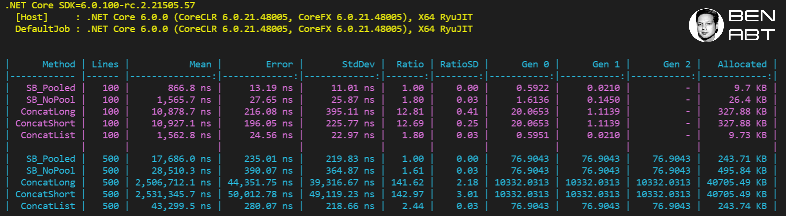

# 🌳 Sustainable Code - String Builder Pooled Performance Comparison 📊

This sample, based on .NET 6 RC2 and the [Object Pool Pattern](https://docs.microsoft.com/dotnet/api/microsoft.extensions.objectpool.objectpool-1?view=dotnet-plat-ext-5.0&WT.mc_id=DT-MVP-5001507), shows very clearly how the reuse of object instances can massively increase performance while reducing memory consumption.

Sample with ASP.NET Core: [Object reuse with ObjectPool in ASP.NET Core](https://docs.microsoft.com/aspnet/core/performance/objectpool?view=aspnetcore-5.0&WT.mc_id=DT-MVP-5001507)

## 🔥 Benchmark

For better comparability, additional string concat were added.



## 🏁 Results

- 🔋 StringBuilder has the best performance and lowest allocations
- 🐏 No additional memory allocations (only if strings are huge) for the string builder instance
- 🏃‍♀️ The larger the strings, the clearer the performance advantage for pooling.
- 🚀 The ratio clearly shows: without pool up always slower and huge allocations (incl. expensive Gen2) for this sample
- 🎒 ConcatList uses string.concat(IEnumable), which uses the internal type [ValueStringBuilder](https://github.com/dotnet/runtime/blob/46a3bfeffec2fb6b33bfd152d33f33b544e401c9/src/libraries/System.Private.CoreLib/src/System/String.Manipulation.cs#L193) under the hood, why the allocation is almost the same

## Remarks

- There are also more performant solutions with unsafe code.
- If you know the total string size, use string.create to benefit from pre-allocations.

## ⌨️ Run this sample

```shell
dotnet run -c Release
```

This benchmark runs several minutes (2:50min min on my workstation)
